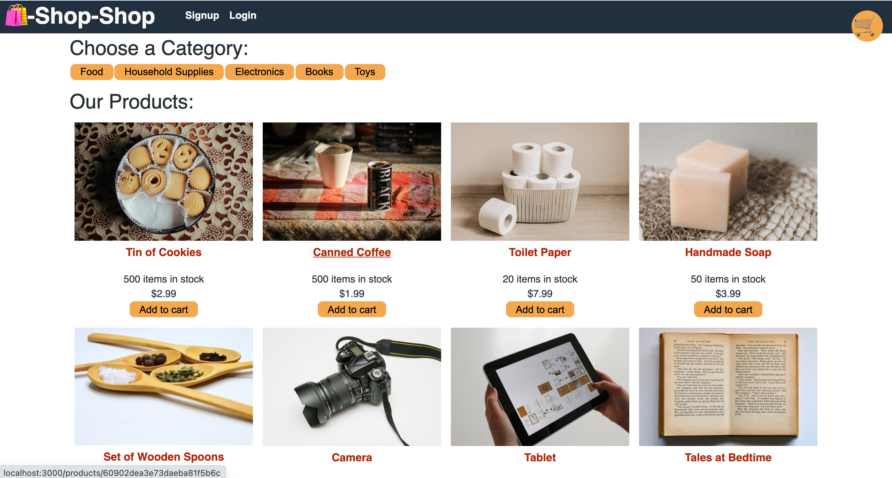

# Shop-Shop

## Description: 
Shop-Shop is a shopping website that uses React for the front end and Redux for state management. Orders to the website are handled by Stipe for payment management, and redirected back to the homepage of Shop-Shop. Users must be signed up and logged-in in order to make a purchase. The login verification comes from Json Web Tokens. 

## Questions <a name="questions"/>
Questions? Comments? Please Reach out to me by [Email](mailto:benn925@yahoo.com) or on [Github](https://github.com/benwade91).

